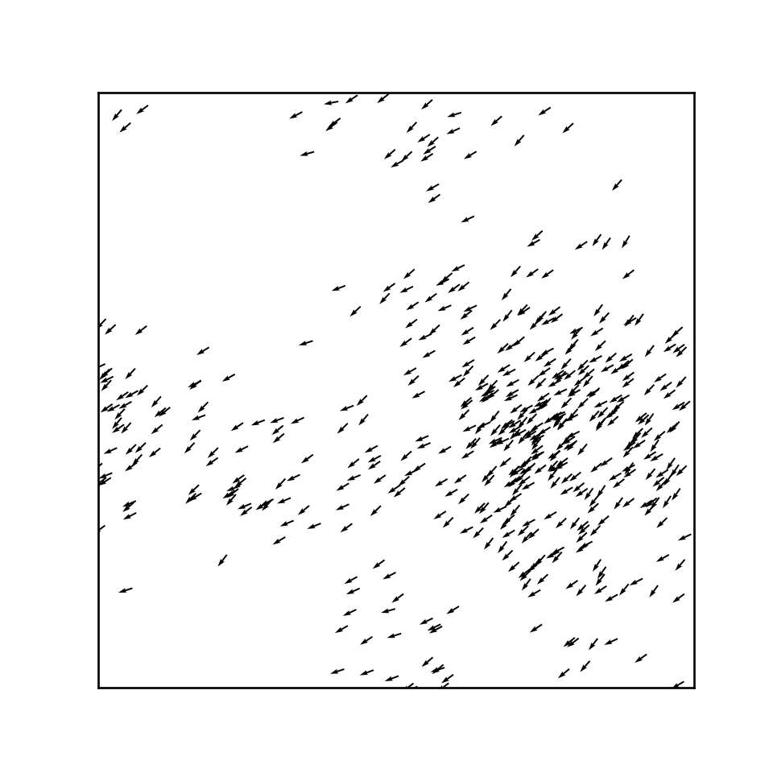

# Requirements to run
This program requires the install of the following:
```
    pytorch, cython, numpy and matplotlib
```

# How to run the program
Use this command to run the test of the program
```
    python performance_test.py
```

To run the program with the visualizations this variable has to be ```True``` in the relevant file(cythonfn.pyx, pytorchfn.py or activematter.py):
```
    plotRealTime = True
```

# Results
The results of from the test will be written to the /data folder with the name of the file corresponding the the test and the line of the result corresponding to the size of the input data.

# activematter-python
Active Matter simulation

## Create Your Own Active Matter Simulation (With Python)

### Philip Mocz (2021) Princeton Univeristy, [@PMocz](https://twitter.com/PMocz)

### [📝 Read the Algorithm Write-up on Medium](https://medium.com/swlh/create-your-own-active-matter-simulation-with-python-76fce4a53b6f)

Simulate Active Matter: Viscek model for flocking birds


```
python activematter.py
```


